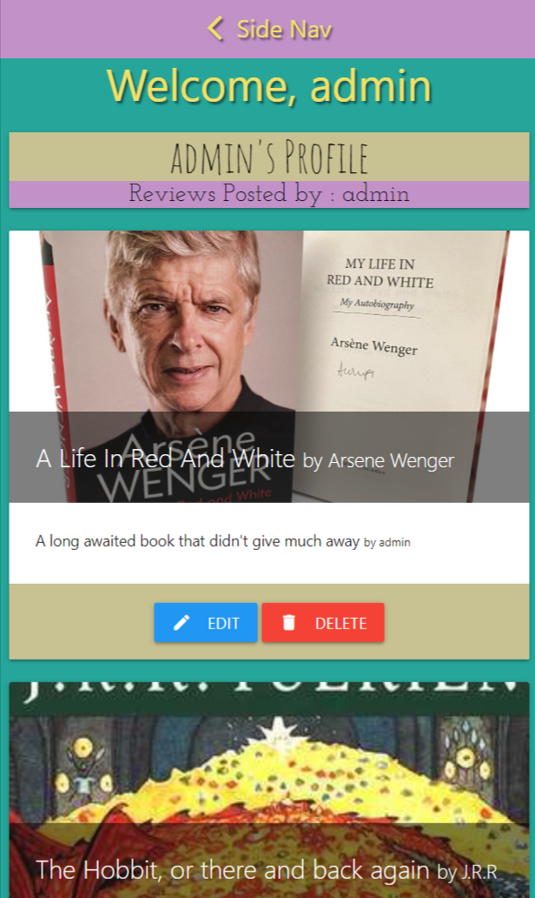
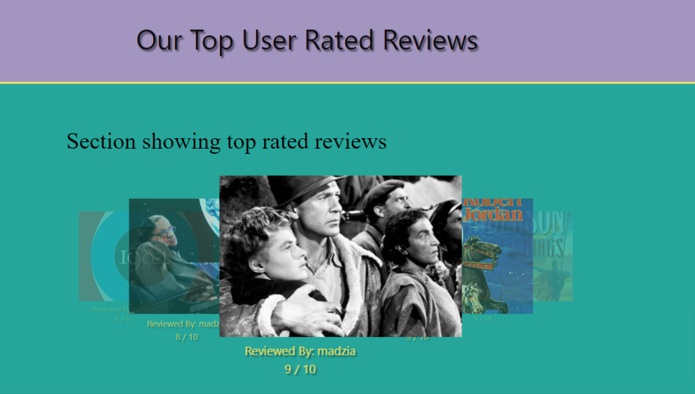
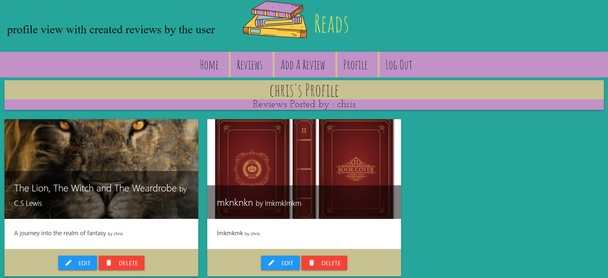
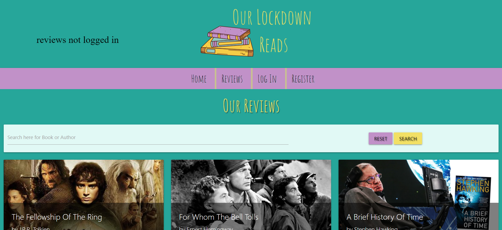
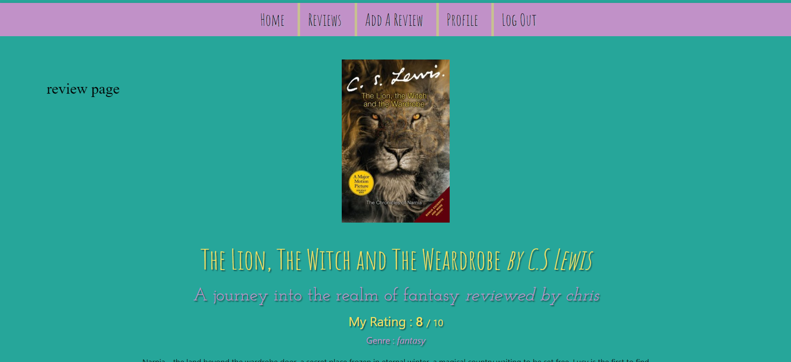
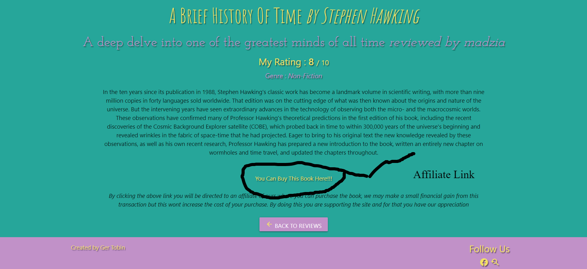

# Our Lockdown Reads

Our Lockdown reads is a community driven site where users can come to 
review books they have read during lockdown and read other members reviews of other books.
The website will build a database of the books our users have read and provide links to purchase 
the books should our users choose to.

## Table of contents

## UX 

### Project Goals

The Goal of this project is to create a user friendly interface so users can submit the books that 
they have read through lockdown and being able to read other users reviews , this goal will be achieved by 
building a database and providing functionality to the users to create , read update and delete their posts.
there will also be links to the books reviewed so if a user likes a book they can follow the link and 
purchase he book for themselves.

### User Goals 

- Create a Profile upon registering

- Create a book review

- Read other users reviews

- Be able to purchase a book I liked 

-  See which book reviews are most liked 

### User Stories

As a first time user of the website I would like to:

- Register and create my profile

- Leave a review for a book I read during lockdown

- Read other users reviews

- Be able to follow a link to purchase a book whose review I liked

As a returning user I would like to:

- Edit or Update my profile

- Edit or Delete my book reviews

- See if there is any new reviews since my last visit 

### Site Owner Goals 

As the site owner I would like to: 

- Build a database of all the books my users read during lockdown.

- Be able to see which books were most liked so as to see what book I might read next

- With affiliate links to online book stores the website could work as a business model where 
I could generate revenue through my users purchasing books through the links provided in the reviews

### User Requirements and Expectations

- Well layed out UX design which is user friendly, easy to navigate,
accessable and responsive

- The user should be able to navigate easily throughout the site, this could easily be attained with the use of a navbar

- The site should be able to handle, access, store and present back the data to the user 
in clear , strucured way

- The user should be the only one able to edit and delete his/her reviews while all users should be able to read the reviews

- Editing and deleting of reviews and creating new reviews should be granted to users by the principles of C-R-U-D functionality

## Structure Of The Project

The main focus of the website is being able to utilize the database and display the correct conents to the user.
I have used mongodb to create 3 collections for storing the data , they are users for 
storing our registered users passwords and username to access their profile and create, update and delete their reviews. All users registered 
or not can read all reviews.
the next collection is labelled Books and this will store all the data
for the book in which a user has reviewed and will be stored under the following keys

- _id
- book_name
- book_author
- genre 
- rating 
- review_title
- review
- reviewed_by
- image_url
- purchase_link

with the data that has been input to the fields we should be able to create 
an informative site hat is pleasing to the eye.

I will have a collection called users which will contain all registered users and their (hashed) passwords

- username      :     this value will be used to fill in the reviewed_by field in the previous collection

- password

Lastly I have created a collection for genres which will relate to the genre 
field of the previous database, this will help to organize the books by genre 
and I will be able to add more genres if or split an over subscribed genre into 
2 seperate genres.

gernre       :     this value will be an option for users to select when submitting a reviewed book

## Design Choices 

### Fonts

- The font that I have chosen for headers and titles on my site was [Amatic SC](https://fonts.google.com/specimen/Amatic+SC) from Google fonts

- For the main paragraphs and bodies of text I chose [Josefin](https://fonts.google.com/specimen/Josefin+Sans) also from Google fonts

### Colour Scheme

-  `#26a69a` This aqua colour was used mainly for the backgrounds

-  `#f2e065` This bright gold colour was used for headings and for the backgound colour of buttons

-  `#C191C8` This pale purple was used in the navbar and as a background colour in our review cards

- I used these colours and slight variants throughout the website. They are triadic colours and I got them from [w3schools]("https://www.w3schools.com/colors/colors_schemes.asp)

### Icons

- I used the built in Icons that come with materialize, Material Icons ,
which can be found [here](https://fonts.google.com/icons)

### Wireframing

- I built my projects on the outlines of these wireframes , my design has 
changed a bit throughout development , but these were instrumental in building the foundation of my project.
My wireframes are stored in .pdf format [here](static/wireframes/our-lockdown-reads-wireframes.pdf)

### Features

- __Responsive Navbar:__ A navbar that responds to the users screen size, and collapses to a side nav on mobile devices. 

- __A Carousel:__ A carousel that displays the top 5 rated reviews. 

- __A Registered Users Profile Page:__  A page that displays all the reviews that a user has submitted , with options to edit and delete them.

- __A Page Displaying All The Reviews:__  A page that displays all the reviews all the reviews from every user

- __A page to display more information about a selected book:__ When you see a review that you like you can click a button 
and it will bring you to the display book pge tht contain all the avaible information on the book and the users review.

- __An Affiliate Link:__ A link supplied by the user to the website where a book can be purchased. Other users can click on the link to purchase the book
. This can be worked out later but for a business stand point this is essential
 and would require more work.

### Future Features

- I would like to implement a star rating that other users could rate reviews

- I would also like to add a comment section after reviews to give feedback to users

### Technologies Used

- __HTML:__ The HyperText Markup Language, or HTML is the
 standard markup language for documents designed to be displayed in a web browser.

- __CSS:__ Cascading Style Sheets (CSS) is a style sheet language used for describing the presentation of a document written in a markup language such as HTML. 
 is a cornerstone technology of the World Wide Web, alongside HTML and JavaScript.[

- __JAVASCRIPT:__ JavaScript, often abbreviated as JS, is a programming language that conforms to the ECMAScript specification. JavaScript is high-level, often just-in-time compiled
, and multi-paradigm. It has curly-bracket syntax, dynamic typing, prototype-based object-orientation, and first-class functions. 

- __JQUERY:__ jQuery is a JavaScript library designed to simplify HTML DOM tree traversal
 and manipulation, as well as event handling, CSS animation, and Ajax.

- __PYTHON:__ Python is an interpreted high-level general-purpose programming language.
 Python's design philosophy emphasizes code readability with its notable use of significant indentation. 
 Its language constructs as well as its object-oriented
 approach aim to help programmers write clear, logical code for small and large-scale projects. 

- __MONGODB:__ MongoDB is a source-available cross-platform document-oriented database program.
 Classified as a NoSQL database program, MongoDB uses JSON-like documents with optional schemas.
 MongoDB is developed by MongoDB Inc. and licensed under the Server Side Public License (SSPL)

- __PYMONGO:__ PyMongo is a Python distribution containing tools for working with MongoDB,
 and is the recommended way to work with MongoDB from Python.

- __FLASK:__ Flask is a micro web framework written in Python. It is classified as a microframework
 because it does not require particular tools or libraries.

### Testing

#### Manual Testing

- You can find all the manual testing that I have done [here](manual_testing.md)

#### Validation Checks 

- HTML checks via [w3validator](https://validator.w3.org/)

- All pages have passed HTML you can see the results 

- [login](static/validation-images/Showing-results-for-http-our-lockdown-reads-herokuapp-com-login-Nu-Html-Checker.png)

- [add review](static/validation-images/Showing-results-for-http-our-lockdown-reads-herokuapp-com-add_review-Nu-Html-Checker.png)

- [edit genre](static/validation-images/Showing-results-for-http-our-lockdown-reads-herokuapp-com-edit_genre-60bbeec4ebb8a36e86746b87-Nu-Html-Checker.png)

- [manage genres](static/validation-images/Showing-results-for-http-our-lockdown-reads-herokuapp-com-manage_genres-Nu-Html-Checker.png)

- [reviews](static/validation-images/Showing-results-for-http-our-lockdown-reads-herokuapp-com-reviews-Nu-Html-Checker.png)

- [home](static/validation-images/Showing-results-for-http-our-lockdown-reads-herokuapp-com-home-Nu-Html-Checker.png)

- [register](static/validation-images/Showing-results-for-http-our-lockdown-reads-herokuapp-com-register-Nu-Html-Checker.png)

- For CSS validation I used [jigsaw](https://jigsaw.w3.org/css-validator/)

- My custom css passed but I encountered 1 error with the materialize package I installed, You can see that [here](static/validation-images/css-validation.png)

- For my JavaScript/jQuery I used [JShint](https://jshint.com/) which showed no errors , you can see the results [here](static/validation-images/js-validation.png)

### Bugs / Fixes

- __bug:__ Had an issue at the start of the project when I was installing flask anfd pymongo where I was getting 
a linting error that it was an unresolved download.

- __fix:__ I eventually had to start a new repository after an hour of using Google to try and solve the issue didnt work. 
 I copied and pasted the code I had wrote and installed all the appropriate files and it worked.

- __bug:__ I created a custom class called deep-purple but instead of changing the text purple it was changing the background

- __fix:__ To solve this I opened chrome developer tools and found that deep-purple was a custom class created by materialize which hadthe background color set to important so I just altered
the name of my class to true-purple and used it instead.

- __bug:__ Encountered a bug where the profiles were not displaying evenly on the page , it appeared that some of the reviews were skipping the 
columns allocated to them.

- __fix:__ Trying to solve this problem I saw that the card content part of the cards was varying in height, causing the subsequent cards to 'pop' to
the next column that had the appropriate space, I solved this by giving all the card content the uniform height of 75px.

- __bug:__ I encountered a bug where the genre of the books reviewed was saving to the database as Null.

- __fix:__ I had the id of genre as genre_name instead of just genre as genre_name is used in a different database

- __bug:__ I encountered a problem where the Return home button on the review page pushed to the right when only one item appeared on the bottom row

- __fix:__ I solved this problem by applying the css property of margin-right: 35vmin , to ensure that there was sufficient margin on the right to give the button its own row

- __bug:__ I found an issue where pressing the back button when I wasnt logged in sent me to a 404 error

- __fix:__ I solved this with an if statement which checked if the user was logged in and if the user was not logged in it sent them to the home page instead

- __bug:__ I encountered a bug in development when I logged out with a user account that it brought me back to login page as expected,
but if I pressed back it returned me to the previous page and still had access to the logged in menu.

- __fix:__ I resolved this issue by checking if there was a session: object at the start of the function and redirecting to the login page

- __bug:__ I found a bug whenever I tried to delete a 2nd or 3rd book in a users profile I deleted the first book instead.

- __fix:__ I fixed this issue by putting the book_id in the modal id

### Deployment

### Credits

- [randomkeygen.com](https://randomkeygen.com/) for allowing me to create a secure secret key.

- [canva.com](https://www.canva.com/) for the free pro trial which allowed me to create my logo.

- [Code Institute](https://codeinstitute.net)
who without their walkthrough project and very clear explanations of the concepts involved in undertaking a difficult project, without which 
I wouldnt of been able to do this.