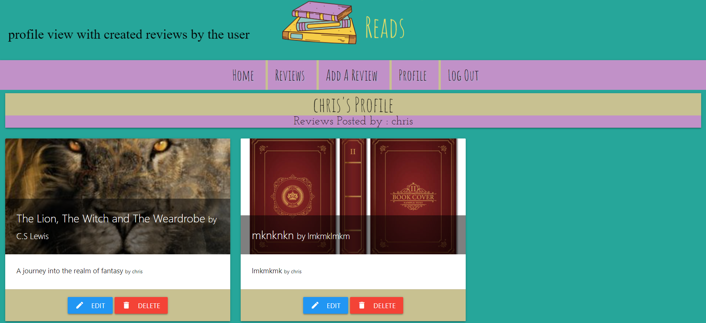
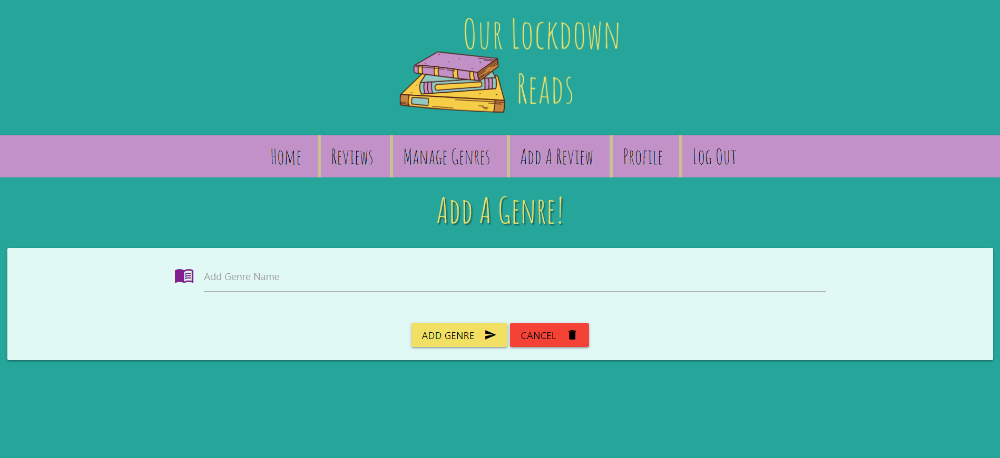

# Manual Testing 

My manual testing was really happening throughout the whole development phase, where upon each section/feature that was added
was checked by me before moving on to the next section. The bugs I found in development can be seen the the bugs/fixes section of the readme file.

## Functionality Testing 

- The main function of the website is to display users reviews which are stored in our database, 
allow a website user to create a profile via a registration form, log in , create a new review and store it in the database, edit a review,
delete a review and for a user to log out of the website. The admin can also access an extra option of the navbar which he can then manage the genres.

- To check the reviews that users have submitted are displaying I opened the website on the landing page and clicked on reviews. I was brought 
to the review section and all appeared as expected 

- To see if my registration page was functioning correctly I decided to register a new user by the name of Chris. I clicked on
the register button on the landing page and it brought me to the registration page where I created my account. It said my account 
was created successfully and then I checked mongodb and it appeared in the users section.

- To see if the registration form I had completed was stored and then I was able to reuse the stored login to gain access to my profile, I had logged out 
and logged in again to m account. this worked as expected and brought me to my profile page. 

- To create a new review , and have it store and display correctly in the database is a the core concept of this project so ensuring 
this was working was of upmost priority. I logged in with my account with the username of chris which gave me access to the 
add review section of the website. Here I filled out a form which had validation requirements. After successfully adding the review I was 
given a message stating it was added successfully. I then checked my profile and I could see the review, I then checked my mongo database and it wasdisplaying there too. It 
was working as intended. 

- To edit a review I again had to log in and go to my profile through the navigation links. On my profile under each 
review is an edit button. I clicked this button and it brought me to a form with all the values prefilled from the previous post. Here I could 
choose which fields I could edit if I wanted to or just press cancel which would bring me back to my profile. All options worked as intended. 

- To delete a review I just followed the same process as before but instead of pressing the edit button I pressed the delete button.
Upon doing this a modal appeared and gave me 2 options, delete the review or cancel , pressing cancel just brought me back to the profile page 
whereas pressing delete deleted a review I had made earlier. I then checked the database and the review was removed from there too.

- Lastly the user would require to be able to log out of the webpage and keep his account safe. To test this I simply logged in 
and then logged out , I also tried pressing the back button to check if the defensive programming I had deploed earlier would work byredirecting to the log in screen , all worked as intended.

- As the admin I would like to be able to manage the categories in the website, As I could tailor the types of books entering the database.
The first option would be to add a new category so to test this I have logged in as admin.
Now the option manage categories appears in the navbar I have access to the page. I click on the link and then proceed to 
click the add genre button. It brings me to a form with a text field.I enter a new genre (food). I press submit.
I get redirected back to manage genres with a successfully added message. I then proceed to mongodb and check my genres collection 
and it has been successfully updated with the new genre food.

- To edit a enre I simply repeat the steps above but instead of clicking add a genre, I go to the 
genre I want to edit and I click the edit button on that genre. It brings me to a rext input form with the genre I want to edit 
already prefilled in the input field. All works as expected. 

- Lastly I, as an admin might want to delete irrelevant genres so to check if this function is working I follow the previous 
steps but click on the delete button instead , this displays a pop up modal asking me to confirm that I wish to delete the selected genre, or I can press cancel
and go back to the manage genres page. All works as intended.

- All forms have been checked and the validation is working as intended.

- All internal links are working as intended but user supplied urls would have to be checked by admin as to check if they redirect to the correct location.
Further work is needed in this regard.

## Usability 

- I have checked the navbar and sidenav bar and all direct to the intended pages and work correctly.

- All buttons and navigation buttons redirect to intended locations with no errors.

- I have used black text on the background colours that I have chosen as it gives the greatest contrast for readability.

- Buttons and Nav are bright and easy to see and use.

- All user actions recieve clear feedback.

## Database testing

- This was carried out in my functionality testing as I was checking the database was storing updating and deleting 
data as requested. I came across no errors.

## Compatibility testing

- I was basing my development on Google Chrome and was doing all my tests on that browser, so to make sure it was working on 
other browsers too I tested them on mozilla firefox and microsoft edge.

- I opened my website in firefox and did all the previous checks and I didnt notice anything different , everything behaved as expected.

- I opened my website in microsoft edge and again everything worked as expected and it all appeared as expected.

## Responsiveness testing 

- All throughout development I have been using Chrome Developer tools to check my webpages and to see what alterations I could make 
and also to see how it would look on mobile and laptop devices.

- To check my deployed site I used [Am I Responsive](http://ami.responsivedesign.is/) along with my mobile and Chrome Developer tools.
All appeared to look good on all devices and gave a positive user experience. Below are the Screenshots I have captured.

